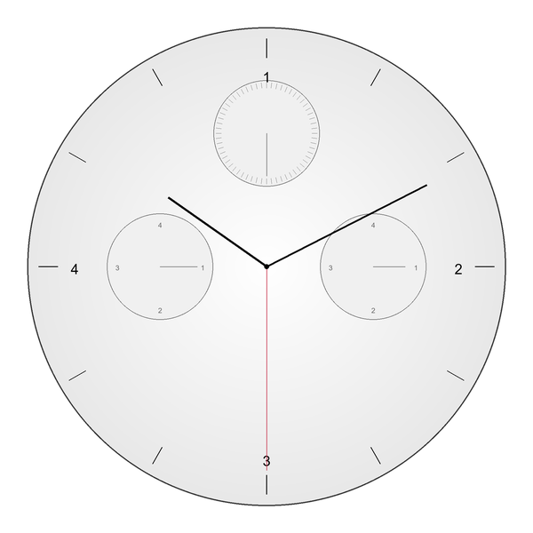
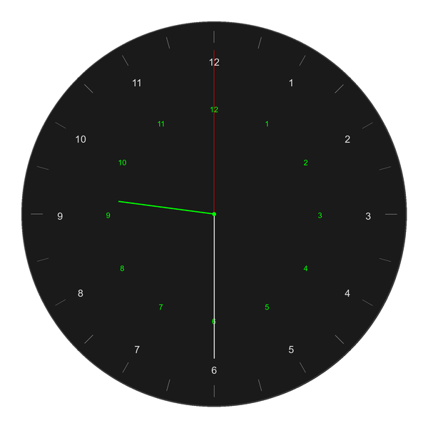
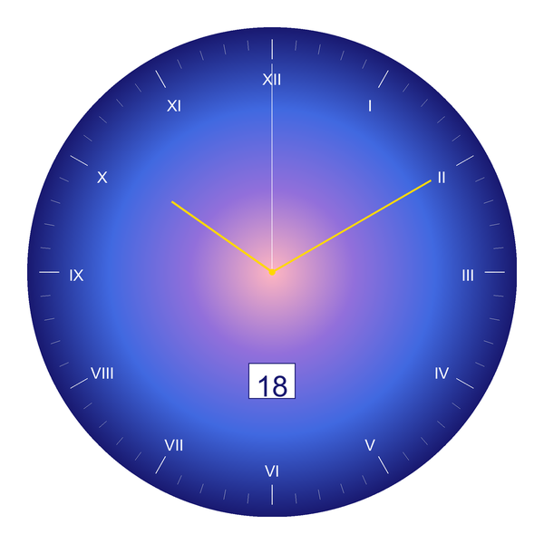
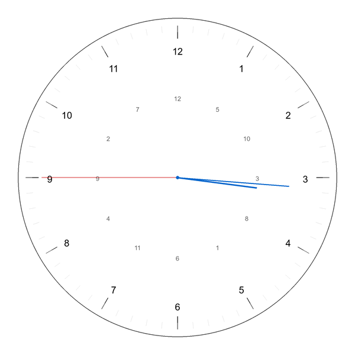
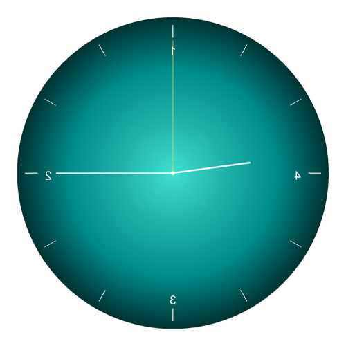
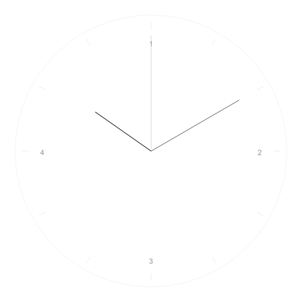
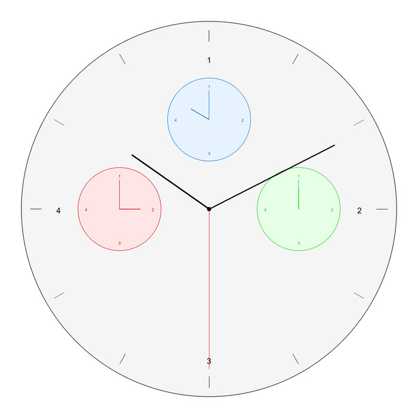

# Examples

This page showcases the advanced capabilities of the dial library through a gallery of complex clock designs. All examples can be generated by running `examples/showcase.py`.

## Gallery

### 1. Chronograph with Sub-Dials

Multi-dial chronograph with three independent sub-dials demonstrating custom positioning and independent time displays.



**Key Features:**
- Main dial with radial gradient background
- Three sub-dials with custom centers and radii
- Independent time displays for each dial
- Selective numeral visibility (12, 3, 6, 9)

```python
import dial

config = {
    "width": 600,
    "height": 600,
    "antialias": True,
    "scale_factor": 3,
    "elements": [
        # Main face with gradient
        {
            "type": "Face",
            "properties": {
                "shape": "circle",
                "color": {
                    "type": "radial",
                    "colors": ["#ffffff", "#e8e8e8"],
                    "center": [0.5, 0.5],
                },
                "border_color": "#333",
                "border_width": 4,
            },
        },
        # Main ticks and numerals
        {
            "type": "Ticks",
            "properties": {
                "hour_spec": {
                    "shape": "line",
                    "color": "black",
                    "length": 0.08,
                    "width": 3,
                }
            },
        },
        {
            "type": "Numerals",
            "properties": {
                "system": "arabic",
                "color": "black",
                "font_size": 48,
                "visible": [12, 3, 6, 9],
            },
        },
        # Sub-dial 1: Seconds counter (top)
        {
            "type": "Face",
            "properties": {
                "center": [300, 150],
                "radius": 60,
                "shape": "circle",
                "color": "#f0f0f0",
                "border_color": "#666",
                "border_width": 2,
            },
        },
        {
            "type": "Hands",
            "properties": {
                "center": [300, 150],
                "radius": 60,
                "time": "0:0:30",
                "second_spec": {"color": "#666", "length": 0.8, "width": 2},
            },
        },
        # Additional sub-dials...
        # Main hands
        {
            "type": "Hands",
            "properties": {
                "time": "10:10:30",
                "hour_spec": {"color": "black", "length": 0.5, "width": 8},
                "minute_spec": {"color": "black", "length": 0.75, "width": 6},
                "second_spec": {"color": "#c41e3a", "length": 0.85, "width": 2},
            },
        },
    ],
}

clock = dial.Clock.from_config(config)
clock.save("gallery_chronograph.png")
```

---

### 2. 24-Hour Military Clock

Full 24-hour military time display with both 1-12 and 13-24 numerals.



**Key Features:**
- 24-hour divisions instead of standard 12
- Dual numeral rings (outer 1-12, inner 13-24)
- Military time mode for hands
- Dark tactical color scheme

```python
import dial

config = {
    "width": 600,
    "height": 600,
    "antialias": True,
    "scale_factor": 3,
    "elements": [
        {
            "type": "Face",
            "properties": {
                "shape": "circle",
                "color": "#1a1a1a",
                "border_color": "#4a4a4a",
                "border_width": 3,
            },
        },
        # 24 hour divisions
        {
            "type": "Ticks",
            "properties": {
                "divisions": 24,
                "hour_spec": {
                    "shape": "line",
                    "color": "#888",
                    "length": 0.06,
                    "width": 2,
                },
            },
        },
        # Outer ring: 1-12
        {
            "type": "Numerals",
            "properties": {
                "system": "arabic",
                "values": [1, 2, 3, 4, 5, 6, 7, 8, 9, 10, 11, 12],
                "color": "#e0e0e0",
                "font_size": 42,
            },
        },
        # Inner ring: 13-24
        {
            "type": "Numerals",
            "properties": {
                "system": "arabic",
                "values": [13, 14, 15, 16, 17, 18, 19, 20, 21, 22, 23, 24],
                "radius_offset": -0.25,
                "color": "#00ff00",
                "font_size": 32,
            },
        },
        # 24-hour mode hands
        {
            "type": "Hands",
            "properties": {
                "time": "18:30:00",
                "mode": "24h",
                "hour_spec": {"color": "#00ff00", "length": 0.5, "width": 6},
                "minute_spec": {"color": "#e0e0e0", "length": 0.75, "width": 4},
                "second_spec": {"color": "#ff0000", "length": 0.85, "width": 2},
            },
        },
    ],
}

clock = dial.Clock.from_config(config)
clock.save("gallery_24hour_military.png")
```

---

### 3. Radial Gradient with Date Window

Stunning radial gradient background with Roman numerals and positioned date overlay.



**Key Features:**
- Multi-stop radial gradient (pink → purple → blue → midnight)
- Roman numeral system
- Date window overlay with custom positioning
- Golden hour and minute hands

```python
import dial

config = {
    "width": 600,
    "height": 600,
    "antialias": True,
    "scale_factor": 3,
    "elements": [
        {
            "type": "Face",
            "properties": {
                "shape": "circle",
                "color": {
                    "type": "radial",
                    "colors": ["#FFB6C1", "#9370DB", "#4169E1", "#191970"],
                    "center": [0.5, 0.4],
                },
                "border_color": "#191970",
                "border_width": 4,
            },
        },
        {
            "type": "Ticks",
            "properties": {
                "hour_spec": {
                    "shape": "line",
                    "color": "white",
                    "length": 0.08,
                    "width": 3,
                },
                "minute_spec": {
                    "shape": "line",
                    "color": "#e0e0e0",
                    "length": 0.04,
                    "width": 1,
                },
            },
        },
        {
            "type": "Numerals",
            "properties": {
                "system": "roman",
                "color": "white",
                "font_size": 52,
            },
        },
        {
            "type": "Overlay",
            "properties": {
                "type": "date_window",
                "position": [300, 420],
                "date": "2025-10-18",
                "font_size": 32,
                "text_color": "#191970",
                "background_color": "white",
                "border_color": "#191970",
                "padding": 8,
            },
        },
        {
            "type": "Hands",
            "properties": {
                "time": "10:10:00",
                "hour_spec": {"color": "#FFD700", "length": 0.5, "width": 8},
                "minute_spec": {"color": "#FFD700", "length": 0.75, "width": 6},
                "second_spec": {"color": "white", "length": 0.85, "width": 2},
            },
        },
    ],
}

clock = dial.Clock.from_config(config)
clock.save("gallery_gradient.png")
```

---

### 4. Dual Ring Clock

Clock with dual numeral rings - hours outer, minutes inner.



**Key Features:**
- Two independent numeral rings using `radius_offset`
- Outer ring: hours (1-12)
- Inner ring: minutes (5-60 in 5-minute increments)
- Different font sizes and colors for each ring

```python
import dial

config = {
    "width": 600,
    "height": 600,
    "antialias": True,
    "scale_factor": 3,
    "elements": [
        {
            "type": "Face",
            "properties": {
                "shape": "circle",
                "color": "white",
                "border_color": "#333",
                "border_width": 3,
            },
        },
        {
            "type": "Ticks",
            "properties": {
                "hour_spec": {
                    "shape": "line",
                    "color": "black",
                    "length": 0.08,
                    "width": 3,
                }
            },
        },
        {
            "type": "Ticks",
            "properties": {
                "divisions": 60,
                "hour_spec": {
                    "shape": "line",
                    "color": "#ccc",
                    "length": 0.04,
                    "width": 1,
                },
            },
        },
        # Outer ring: hours
        {
            "type": "Numerals",
            "properties": {
                "system": "arabic",
                "values": [1, 2, 3, 4, 5, 6, 7, 8, 9, 10, 11, 12],
                "radius_offset": 0.0,
                "color": "black",
                "font_size": 48,
            },
        },
        # Inner ring: minutes
        {
            "type": "Numerals",
            "properties": {
                "system": "arabic",
                "values": [5, 10, 15, 20, 25, 30, 35, 40, 45, 50, 55, 60],
                "radius_offset": -0.3,
                "color": "#666",
                "font_size": 32,
            },
        },
        {
            "type": "Hands",
            "properties": {
                "time": "3:15:45",
                "hour_spec": {"color": "#0066cc", "length": 0.5, "width": 8},
                "minute_spec": {"color": "#0066cc", "length": 0.7, "width": 6},
                "second_spec": {"color": "#cc0000", "length": 0.85, "width": 2},
            },
        },
    ],
}

clock = dial.Clock.from_config(config)
clock.save("gallery_dual_ring.png")
```

---

### 5. Mirrored Clock

Clock with horizontal flip post-processing transformation.



**Key Features:**
- Image flipped horizontally after rendering
- Demonstrates post-processing capabilities
- Turquoise radial gradient background
- Selective numerals (12, 3, 6, 9)

```python
import dial

config = {
    "width": 500,
    "height": 500,
    "antialias": True,
    "scale_factor": 3,
    "post_processing": {"flip_horizontal": True},
    "elements": [
        {
            "type": "Face",
            "properties": {
                "shape": "circle",
                "color": {
                    "type": "radial",
                    "colors": ["#40E0D0", "#20B2AA", "#008B8B", "#003333"],
                    "center": [0.5, 0.5],
                },
                "border_color": "#003333",
                "border_width": 3,
            },
        },
        {
            "type": "Ticks",
            "properties": {
                "hour_spec": {
                    "shape": "line",
                    "color": "white",
                    "length": 0.08,
                    "width": 3,
                }
            },
        },
        {
            "type": "Numerals",
            "properties": {
                "system": "arabic",
                "color": "white",
                "font_size": 52,
                "visible": [12, 3, 6, 9],
            },
        },
        {
            "type": "Hands",
            "properties": {
                "time": "9:15:00",
                "hour_spec": {"color": "white", "length": 0.5, "width": 8},
                "minute_spec": {"color": "white", "length": 0.75, "width": 6},
                "second_spec": {"color": "#FFD700", "length": 0.85, "width": 2},
            },
        },
    ],
}

clock = dial.Clock.from_config(config)
clock.save("gallery_mirrored.png")
```

---

### 6. Ultra-Minimal Clock

Ultra-minimalist design with only essential elements.



**Key Features:**
- Extremely subtle styling
- Thin hands and delicate ticks
- Muted color palette
- Only cardinal numerals (12, 3, 6, 9)

```python
import dial

config = {
    "width": 500,
    "height": 500,
    "antialias": True,
    "scale_factor": 3,
    "elements": [
        {
            "type": "Face",
            "properties": {
                "shape": "circle",
                "color": "white",
                "border_color": "#e0e0e0",
                "border_width": 1,
            },
        },
        {
            "type": "Ticks",
            "properties": {
                "hour_spec": {
                    "shape": "line",
                    "color": "#ccc",
                    "length": 0.05,
                    "width": 1,
                }
            },
        },
        {
            "type": "Numerals",
            "properties": {
                "system": "arabic",
                "visible": [12, 3, 6, 9],
                "color": "#999",
                "font_size": 36,
            },
        },
        {
            "type": "Hands",
            "properties": {
                "time": "10:10:00",
                "hour_spec": {"color": "#333", "length": 0.5, "width": 3},
                "minute_spec": {"color": "#333", "length": 0.75, "width": 2},
                "second_spec": {"color": "#999", "length": 0.85, "width": 1},
            },
        },
    ],
}

clock = dial.Clock.from_config(config)
clock.save("gallery_ultra_minimal.png")
```

---

### 7. Multi-Timezone World Clock

Clock displaying multiple time zones with independent sub-dials for different cities.



**Key Features:**
- Three independent time zone displays
- Custom positioning for world cities
- Text labels for each timezone
- Different times shown simultaneously

---

## Key Capabilities Demonstrated

The gallery showcases these advanced features:

✓ **Custom Element Positioning** - Use `center` and `radius` properties to position elements anywhere  
✓ **Sub-Dials** - Multiple independent clock faces on one canvas  
✓ **24-Hour Mode** - Full 24-hour time display with proper hand calculations  
✓ **Gradient Backgrounds** - Radial and linear gradients with multiple color stops  
✓ **Date Windows** - Overlay positioning with custom styling  
✓ **Dual Numeral Rings** - Use `radius_offset` for complex layouts  
✓ **Post-Processing** - Image transformations like flip and rotate  
✓ **Complex Styling** - Fine control over colors, sizes, and visual appearance

## Running the Examples

Generate all gallery examples:

```bash
python examples/showcase.py
```